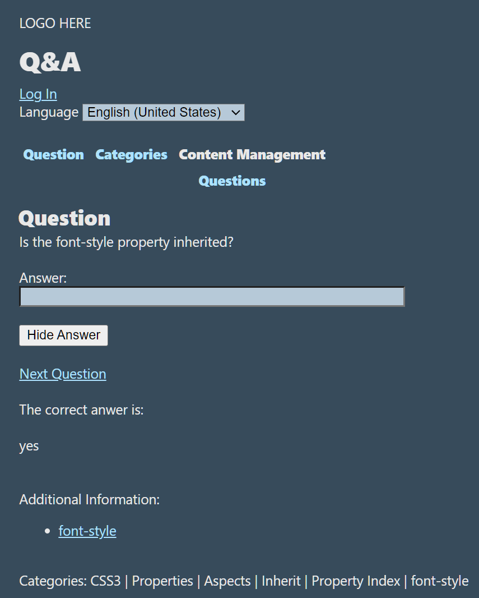
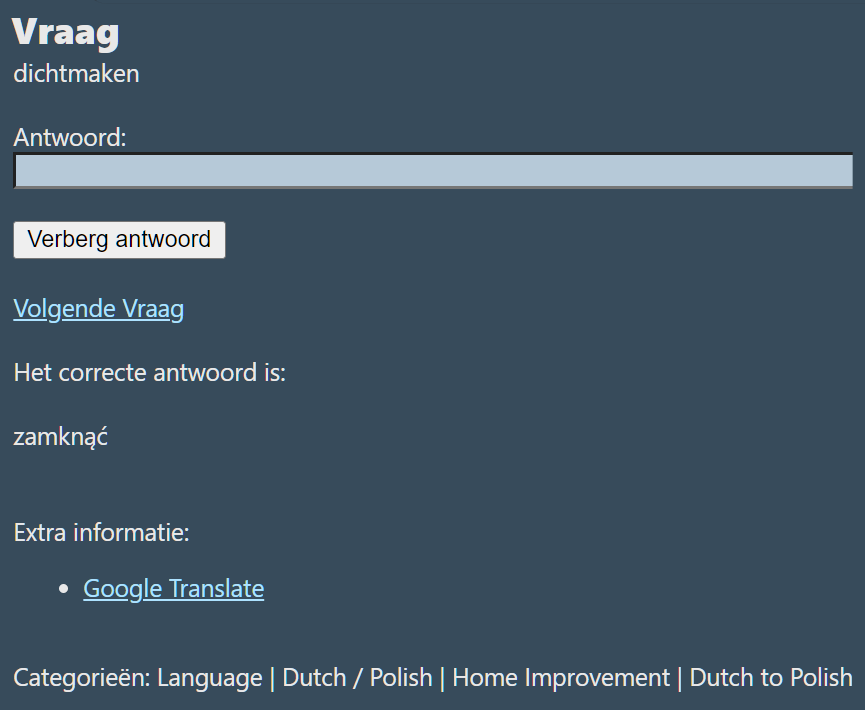

❔ Question & Answer
====================

<h2>📔 Contents</h2>

- [🖼 Screen Shots](#-screen-shots)
- [👋 Intro](#-intro)
- [⚠ WARNING: Weak Password Security ❗](#-warning-weak-password-security-)
- [🏛 Architecture](#-architecture)
- [⚙ Dev Env](#-dev-env)
    - [👨‍💻 Visual Studio](#-visual-studio)
    - [🗄 SQL Server](#-sql-server)
    - [📀 Database](#-database)
    - [📦 JJ.Framework](#-jjframework)
    - [🧱 JJ.Canonical](#-jjcanonical)
    - [📡 Internet Information Services (IIS)](#-internet-information-services-iis)
- [🕘 Checking Out Old Commits](#-checking-out-old-commits)

🖼 Screen Shots
---------------






👋 Intro
--------

*Question & Answer* is an app programmed around 2015 that might train knowledge about certain topics, by randomly asking questions about raw facts about the matter.

The database is loaded with questions about Cascading Style Sheets (CSS) and some Dutch to Polish translations. Also a few questions about Kentico CMS.

You could enter your own question and answers manually too.

There is a utility that makes questions out of import files. In theory you could program your own import too, creating questions in bulk.

It is a web app, but it isn't hosted anywhere. Hosting costs money 😩. So it gets IT-technical setting it up, but in theory you could use the [latest release](https://github.com/jjvanzon/JJ.QuestionAndAnswer/releases/) or go and set up the [dev env](#-dev-env) instead.

⚠ WARNING: Weak Password Security ❗
------------------------------------

__WARNING:__ Passwords in database are not encrypted (stored as plain-text). So better not use passwords that would also protect your valuables. Here are the user names and passwords currently in the database:

    admin	enteentest0!
    devjj79	enteentest0!

🏛 Architecture
---------------

It was definitely also a playground for trying out technologies and ideas about frameworks good and bad. The patterns and practices closely match the following guidelines for structuring software:

[JJ's Reference Architecture](https://github.com/jjvanzon/JJs-Reference-Architecture)

It's model driven, loosely coupled.  
There is separation between data layer, business layer and presentation layer.  
Data layer and presentation have a platform-independent part and a platform-specific part.  
Patterns are used quite rigorously.  
It's multi-lingual.  
Application-independent parts were mostly added to the:

[JJ.Framework](https://github.com/jjvanzon/JJ.Framework)

⚙ Dev Env
-----------

Here you may find some pointers how to set up a developent environment to build and run `JJ.QuestionAndAnswer` projects.

### 👨‍💻 Visual Studio

- Visual Studio Community 2019 or 2022 may be needed to open the projects and solution file, which can be downloaded for free elsewhere.

### 🗄 SQL Server

- SQL Server may be needed too. You may download that elsewhere too.

### 📀 Database

- The database backup can be found under "Database\QuestionAndAnswer"
- The file can be unzipped and restored in SQL Server with name DEV_QuestionAndAnswerDB
- And again with name DEV_QuestionAndAnswerDB_UnitTests
- The database user name "dev" could be expected with password "dev".

### 📦 JJ.Framework

- Pre-release versions of `JJ.Framework` components could be used.
- They may require configuring *NuGet* to connect to an additional package source.
- The following info might be useful for that:
- Name: JJs-Pre-Release-Package-Feed
- Source: https://pkgs.dev.azure.com/jjvanzon/1de16010-421a-41a5-90f1-86e9513f2c5b/_packaging/JJs-Pre-Release-Package-Feed/nuget/v3/index.json

### 🧱 JJ.Canonical

- `JJ.Data.Canonical` and `JJ.Business.Canonical` can also be found right next to the `JJ.Framework` packages in `JJs-Pre-Release-Package-Feed`.

### 📡 Internet Information Services (IIS)

- The web project `JJ.Presentation.QuestionAndAnswer.Mvc` might like to run on IIS (Internet Information Services).
- Otherwise it may not load in Visual Studio.
- Try to *reload* the web project:
- The Output window in Visual Studio might show an expected web address.

<hr />

- It is suggested to install IIS.
- It may be installed by activating it as a *Windows component* on some operating systems.
- Create a web site.
- Point its *physical path* to the folder of the csproj that might not have loaded.
- Having a *binding* that uses the web address previously found in the Visual Studio output as a *host name*.

<hr />

- The file `C:\Windows\System32\drivers\etc\hosts` may need editing.
- Entries like the following might be added:

```
127.0.0.1  dev.questionandanswer.jjvanzon.io
::1        dev.questionandanswer.jjvanzon.io
```

🕘 Checking Out Old Commits
----------------------------

`JJ.QuestionAndAnswer` was once part of a larger code base. It was extracted to become a new git repository with history in tact. Some quirks when checking out older history items, may have to do with that. The following may only be relevant when getting older commits from history (before December 2022).

- Commit messages:
    - Descriptions may mention projects not part of this repo.
- Empty merge commits:
    - Some merge commits without any files associated with it might be found here and there.
- Broken references to `JJ.Framework` or `JJ.Canonical`:
    - `JJ.Framework` / `JJ.Canonical` projects are no longer in the same code base.
    - In some cases it may help to clone the [JJ.Framework](https://github.com/jjvanzon/JJ.Framework) repository and put the `JJ.Framework` folder right next to the `JJ.QuestionAndAnswer` folder. This may fix the broken links.
    - Same for the [JJ.Canonical](https://github.com/jjvanzon/JJ.Canonical) repository to clone in a folder `JJ.Canonical`.
    - But sometimes the paths are still incorrect and may need to be modified. (With Notepad?)
    - You could then use a specific commit from `JJ.Framework` or `JJ.Canonical`'s history.
    - Another option may be to try referencing the NuGet version of these dependencies.
- References to other non-existent projects:
    - To fix this, try referencing the NuGet version of these dependencies.
